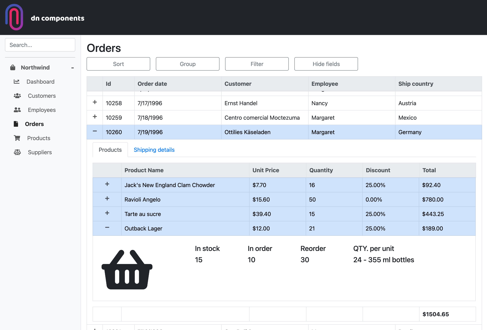
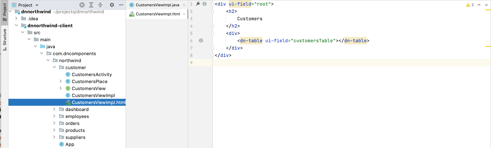
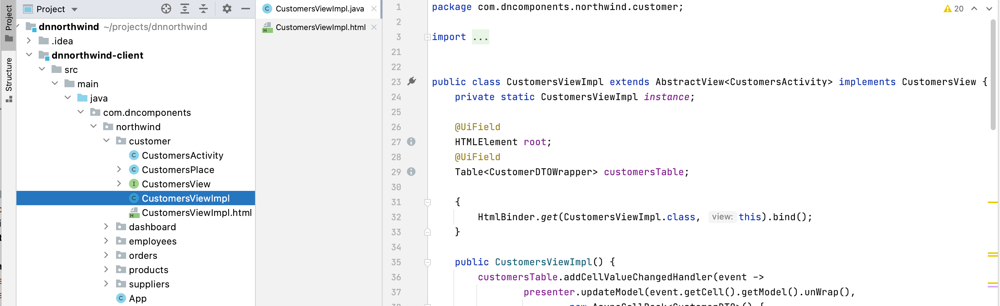

## Dncomponents SpringBoot Example

The goal of the project is to:

1) Demonstrate Dncomponents UI library capabilities
2) Show advantages of MVP pattern and elemental 2 browser API.
3) Show how to combine other js libraries using jsinterop (in this case Chart.js)
4) Give instructions for using DTOs as a lightweight choice for communication with server
5) Promote usage of java language as a frontend choice.

The project uses The Northwind Microsoft database.

### Technology Stack

The project is created with [tbroyer archetype](https://github.com/tbroyer/gwt-maven-archetypes)
and its [spring version](https://github.com/NaluKit/gwt-maven-springboot-archetype) . It is fully J2CL compatible. Only
java language and elemental2 library.

***Frontend***

* [dncomponents](https://dncomponents.com/index.html) UI library with
* [bootstrap 5](https://getbootstrap.com/) css framework
* [Intellij dncompononents plugin](https://plugins.jetbrains.com/plugin/13486-dn-components)
* [GWT compiler](http://www.gwtproject.org/)
* [elemental2](https://github.com/google/elemental2) java browser API library.
* [Chartjs](https://www.chartjs.org/)

***Backend*** _(REST)_

* [SpringBoot](https://projects.spring.io/spring-boot)
* [H2 In Memory database](https://www.h2database.com/html/main.html)
* [Spring data JPA](https://spring.io/projects/spring-data-jpa)
* [Model mapper](http://modelmapper.org/)
* [Maven build tool](https://maven.apache.org/)

<div style="width:1200px">



</div>

### MVP and separation of concern

Dncomponents is devoted to Separation of concerns principle, and has been built upon it. Proper use of MVP pattern is
crucial for good design of web applications. This project demonstrates use of MVP pattern with help
of [Intellij dncompononents plugin](https://plugins.jetbrains.com/plugin/13486-dn-components). You can create a group of
Activity, Place, View, Presenter and ViewImpl classes: right click folder _"File->New->dn-components->create
view/presenter/place group"_.

Your HTML code goes naturally to html files which keeps java code clean and
neat. [HTML binder](https://dncomponents.com/documentation-html-binder.html) and dncomponents plugin makes building user
interface pleasant experience.

<div style="width:1200px">

**html file**



**Java counterpart**



</div>

### Javascript integration

Thanks to `JsInterop`, integration with javascript is simple. E.g. in this project we use Chartjs to show vertical bar
chars. Create .js file and place it at a public folder add this js code:

```javascript
function showStatsJs(canvas, a, label, color, title) {
    const names = a.map(x => x.NAME);
    const values = a.map(x => x.VALUE);
    const chart = new Chart(canvas, {
        type: 'bar',
        data: {
            labels: names,
            datasets: [{
                label: label,
                data: values,
                backgroundColor: color
            }]
        },
        options: {
            scales: {
                yAxes: [{
                    ticks: {
                        beginAtZero: true
                    }
                }]
            },
            title: {
                display: true,
                text: title
            }
        }
    });
}

```

From java code call this function:

```java
    @JsMethod(namespace = GLOBAL)
public static native void showStatsJs(HTMLCanvasElement canvas,JsObject[]a,String label,String color,String title);
```

<div style="width:1200px">


</div>

### DTO rules

_(note: DTO rules are inspired
by [JsInterop DTO strategy](https://github.com/intendia-oss/autorest/wiki/JsInterop-DTO-strategy) but it's different,
even opposite at some elements. However, if it fits to your needs you can use it too)_

For transferring objects use plain javascript objects using JsInterop `native @JsType`. With following rules:

1) Fields should be always package protected! (because they can't be private) Practically we consider them private.
   Never access them directly - use getters and setters methods annotated with `@JsOverlay`.

2) For any java number type, always use Double field except for Long and BigInteger where you should use string field!
   Then type conversion happens through getters and setters methods. For Collections use array field. Always use boxed
   java number types. (Double perfectly fits as a field for numbers. It returns **null** for both **undefined** and **
   null** values. Primitive types are bad in this case because e.g. _**int**_ can't be **null** but can be **undefined**
   .)

3) When transferring objects from server to client always serialize and deserialize only **fields**! Never use getters
   and setters methods. E.g. by default Jackson uses both fields and getters and setters methods for serialization. In
   spring boot you can set this rule on global level like this:

```java
// If you use Spring Boot, you can configure Jackson globally as follows:
@Configuration
public class JacksonObjectMapperConfiguration implements Jackson2ObjectMapperBuilderCustomizer {

    @Override
    public void customize(Jackson2ObjectMapperBuilder jacksonObjectMapperBuilder) {
        jacksonObjectMapperBuilder.visibility(PropertyAccessor.GETTER, JsonAutoDetect.Visibility.NONE);
        jacksonObjectMapperBuilder.visibility(PropertyAccessor.SETTER, JsonAutoDetect.Visibility.NONE);
        jacksonObjectMapperBuilder.visibility(PropertyAccessor.FIELD, JsonAutoDetect.Visibility.ANY);
    }
}
```

Don't consider getters and setters property methods. We want to transfer only fields!

4) It is highly recommended wrapping each DTO object to its pure java wrapper class. The reason is that on a client side
   native JsTypes are not proper Java classes (In GWT terms - nothing of Java object - no equals methods, hashcode,
   toString, instance of...). On server side DTOs are regular java objects. Creating Wrapper classes might look as a
   superfluous step but creating and using them isn't hard at all. Follow this simple rules for Wrapper classes:

#### DTO Wrapper rules

1) Add a private field of DTO type with empty constructor that initialise dto and constructor with dto argument.

2) Delegate all methods from DTO field.

   Don't do this manually, kindly ask your IDE to do this for you. With Intellij: `ctr+enter -> Delegate Methods...`

3) Override equals and hashCode methods

   Usually id from dto object is used for creating equals and hashcode methods.

4) Create _wrap_ and _unWrap_ methods

5) If any getters and setters method use other DTO objects, correct them to use its Wrapper version!

6) On client side transform DTO objects to its wrappers and vice versa when sending back to server.

e.g. Array OrderDTO to List of OrderDTOWrapper

```java

OrderDTO[]orders

private List<OrderDTOWrapper> orderDTOS=Arrays.asList(orders).stream()
        .map(o->o.wrap())
        .collect(Collectors.toList());
```

#### OrderDTO

```java

@JsType(isNative = true, namespace = JsPackage.GLOBAL, name = "Object")
public class OrderDTO {

    Double order_id;
    CustomerDTO customer;
    Double order_date;
    OrderDetailDTO[] orderDetails;

    public final @JsOverlay
    Integer getOrder_id() {
        return order_id == null ? null : order_id.intValue();
    }

    public final @JsOverlay
    void setOrder_id(Integer order_id) {
        this.order_id = order_id == null ? null : Double.valueOf(order_id);
    }

    public final @JsOverlay
    CustomerDTO getCustomer() {
        return customer;
    }

    public final @JsOverlay
    void setCustomer(CustomerDTO customer) {
        this.customer = customer;
    }

    public final @JsOverlay
    Date getOrder_date() {
        return order_date == null ? null : new Date(order_date.longValue());

    }

    public final @JsOverlay
    void setOrder_date(Date order_date) {
        this.order_date = order_date == null ? null : (double) order_date.getTime();
    }

    public final @JsOverlay
    List<OrderDetailDTO> getOrderDetails() {
        return Arrays.asList(orderDetails);
    }

    public final @JsOverlay
    void setOrderDetails(List<OrderDetailDTO> orderDetails) {
        this.orderDetails = orderDetails.toArray(new OrderDetailDTO[0]);
    }

    public final @JsOverlay
    OrderDTOWrapper wrap() {
        return new OrderDTOWrapper(this);
    }

}
```

#### OrderDTOWrapper

```java
public class OrderDTOWrapper {

    //dto delegate methods
    private OrderDTO orderDTO;

    public OrderDTOWrapper(OrderDTO orderDTO) {
        this.orderDTO = orderDTO;
    }

    public OrderDTOWrapper() {
        this.orderDTO = new OrderDTO();
    }

    //override equals
    @Override
    public boolean equals(Object o) {
        if (this == o) return true;
        if (o == null || getClass() != o.getClass()) return false;
        OrderDTOWrapper that = (OrderDTOWrapper) o;
        return this.getOrder_id().equals(that.getOrder_id());
    }

    @Override
    public int hashCode() {
        return this.getOrder_id().hashCode();
    }

    //refer to wrapper version of DTO object
    public CustomerDTOWrapper getCustomer() {
        return orderDTO.getCustomer().wrap();
    }

    public void setCustomer(CustomerDTOWrapper customer) {
        orderDTO.setCustomer(customer.unWrap());
    }

    public Integer getOrder_id() {
        return orderDTO.getOrder_id();
    }

    public void setOrder_id(Integer order_id) {
        orderDTO.setOrder_id(order_id);
    }

    //list of DTOs mapped to wrapper class
    public List<OrderDetailDTOWrapper> getOrderDetails() {
        return orderDTO.getOrderDetails().stream()
                .map(o -> o.wrap())
                .collect(Collectors.toList());
    }

    public void setOrderDetails(List<OrderDetailDTOWrapper> orderDetails) {
        orderDTO.setOrderDetails(orderDetails.stream()
                .map(o -> o.unWrap())
                .collect(Collectors.toList())
        );
    }

    //Unwrap
    public OrderDTO unWrap() {
        return orderDTO;
    }
}

```

### Run Application

```bash
# From the root directory run commands: 

# In one terminal window: 
mvn gwt:codeserver

# In another terminal window: 
mvn spring-boot:run
```
